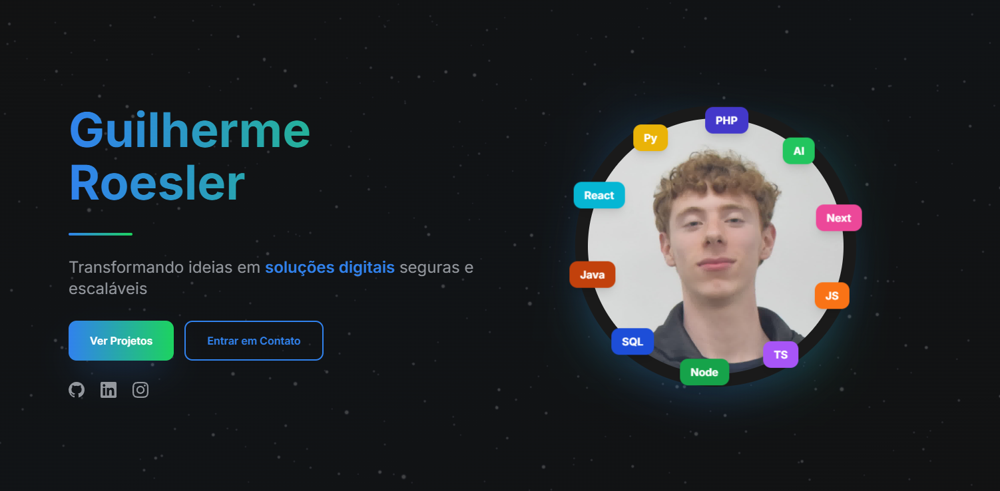

<!--Banner-->

<!--Night Owl image-->

  

<!--Header Name-->

#  I'm Guilherme!

<!--Start Intro-->

I'm a Full Stack Developer and AI enthusiast focused on delivering real value through code. My core stack includes Python, React.js, Node.js, and Django.

- 🎨 **Focus on Experience:** I create beautiful and intuitive interfaces, always prioritizing excellent UX.
- 🚀 **Agility:** Expertise in the rapid and efficient creation of scalable web solutions.
- ⚡ **Adaptability:** I quickly grasp new technologies and transform complex information into real value.
- 💻 Visit my [Portfolio](https://guilherme-roesler.fwh.is) to see my projects in detail.
<!--End Intro-->

<!--Languages and Tools Section-->
<h2 align="center">Tᴇᴄʜ sᴛᴀᴄᴋ</h2> 
<picture>
  <source media="(prefers-color-scheme: dark)" srcset="./Skills_Animation_Dark.gif">
  <source media="(prefers-color-scheme: light)" srcset="./Skills_Animation_White.gif">
  
</picture>
 

<h3 align="left">Current Learning</h3>
<ul align="left">
  <li>Deepening my knowledge in AI development and productivity.</li>
  <li>Exploring low-level languages such as C, C++ and PHP.</li>
  <li>Improving my skills in containerization and Docker.</li>
</ul>

 
 
 
 
 
 
 
 
 
 
 
 

<!--Github stats Table-->
<h2 align="center">📊 Gɪᴛʜᴜʙ Sᴛᴀᴛs 📊</h2>

<table width="100%">
  <tr>
    <td width="50%">
      <h3 align="center"><strong>Gɪᴛʜᴜʙ Sᴛᴀᴛs</strong></h3>
      

        
      

    </td>
    <td width="50%">
      <h3 align="center"><strong>Sᴛʀᴇᴀᴋ Sᴛᴀᴛs</strong></h3>
      

        
      

    </td>
  </tr>
  <tr>
    <td width="50%">
      <h3 align="center"><strong>Lᴀᴛᴇsᴛ Pʀᴏᴊᴇᴄᴛ</strong></h3>
      

        
      

    </td>
    <td width="50%">
    </td>
  </tr>
</table>
 

<!--Contribution Graph-->
<h2 align="center">📈 Cᴏɴᴛʀɪʙᴜᴛɪᴏɴ Gʀᴀᴘʜ 📈</h2>

    

<!--Contact Section-->

<h2 align="center">🤝 Cᴏɴɴᴇᴄᴛ Wɪᴛʜ Mᴇ 🤝 </h2>

  

 

<!--Footer-->

  

